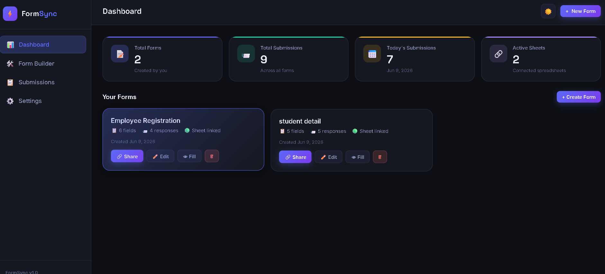
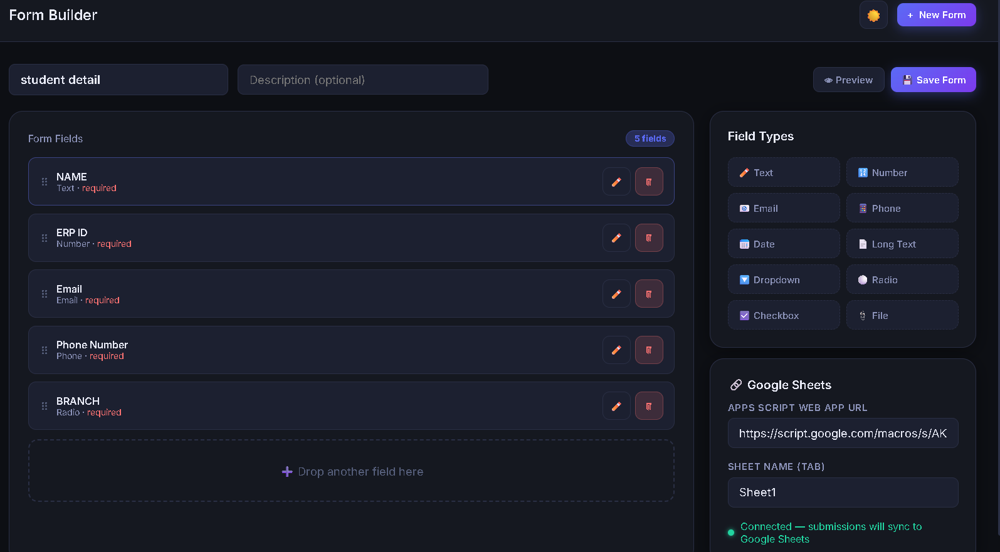
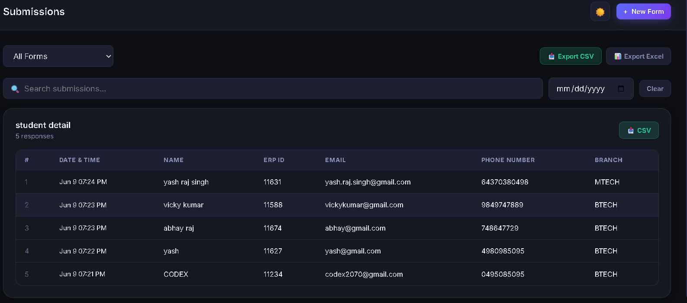
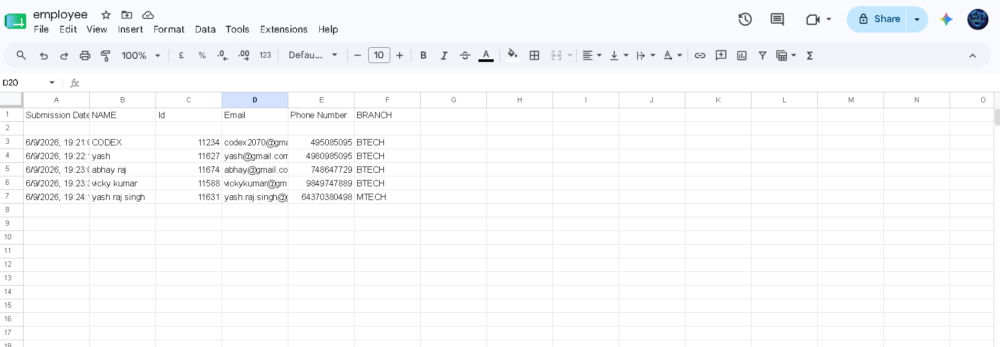

<div align="center">

# ⚡ FormSync

### AI-Powered Form Builder with Google Sheets Integration

[](https://yashkumar07-cyber.github.io/Formsyncs/)
[](https://yashkumar07-cyber.github.io/Formsyncs/)
[](LICENSE)

**FormSync** is a no-code, browser-based form builder that lets you create custom forms and sync responses directly to Google Sheets — no backend required.

</div>

---

## ✨ Features

- 🛠️ **Drag & Drop Form Builder** — Build forms visually with 10+ field types
- 📊 **Google Sheets Sync** — Responses auto-sync via Apps Script Web App
- 📋 **Submissions Dashboard** — View, search, filter, and export all responses
- 📥 **Export CSV / Excel** — Download data in one click
- 🌙 **Dark / Light Mode** — Toggle from Settings
- 🔗 **Shareable Form Links** — Share forms with anyone, no login needed
- 💾 **Local Storage** — All data saved in browser, zero backend needed

---

## 📸 Screenshots

| Dashboard | Form Builder |
|-----------|-------------|
|  |  |

| Submissions | Google Sheets Sync |
|-------------|-------------------|
|  |  |

---

## 🚀 Getting Started

### Option 1 — Use Live Demo (No Setup)

Just visit: **[https://yashkumar07-cyber.github.io/Formsyncs/](https://yashkumar07-cyber.github.io/Formsyncs/)**

### Option 2 — Run Locally

```bash
# 1. Clone the repository
git clone https://github.com/yashkumar07-cyber/Formsyncs.git

# 2. Open in browser
cd Formsyncs
open index.html
# OR just double-click index.html
```

> No npm install, no build step — pure HTML/CSS/JS!

---

## 🔗 Google Sheets Integration (Step-by-Step)

### Step 1 — Create a Google Sheet

Go to [sheets.google.com](https://sheets.google.com) and create a new spreadsheet.

### Step 2 — Open Apps Script

Click **Extensions → Apps Script** in the menu bar.

### Step 3 — Paste the Script

Delete the existing code and paste the following:

```javascript
function doPost(e) {
  try {
    var data = JSON.parse(e.postData.contents);
    var sheet = SpreadsheetApp
      .getActiveSpreadsheet()
      .getSheetByName(data.sheetName || 'Sheet1');

    if (!sheet) {
      sheet = SpreadsheetApp
        .getActiveSpreadsheet()
        .insertSheet(data.sheetName || 'Sheet1');
    }

    if (sheet.getLastRow() === 0) {
      sheet.appendRow(data.headers);
    }

    sheet.appendRow(data.values);

    return ContentService
      .createTextOutput(JSON.stringify({ status: 'ok' }))
      .setMimeType(ContentService.MimeType.JSON);
  } catch(err) {
    return ContentService
      .createTextOutput(JSON.stringify({ status: 'error', message: err.toString() }))
      .setMimeType(ContentService.MimeType.JSON);
  }
}

function doGet(e) {
  return ContentService
    .createTextOutput(JSON.stringify({ status: 'ready' }))
    .setMimeType(ContentService.MimeType.JSON);
}
```

### Step 4 — Deploy as Web App

1. Click **Deploy → New Deployment**
2. Choose type: **Web App**
3. Set **Execute as:** `Me`
4. Set **Who has access:** `Anyone`
5. Click **Deploy** and copy the Web App URL

### Step 5 — Connect to FormSync

In the Form Builder, paste the URL into the **Apps Script Web App URL** field and enter your sheet tab name (e.g. `Sheet1`).

You'll see: ✅ **Connected — submissions will sync to Google Sheets**

---

## 🧩 Supported Field Types

| Field | Description |
|-------|-------------|
| ✏️ Text | Short single-line text |
| 🔢 Number | Numeric input |
| 📧 Email | Validated email address |
| 📱 Phone | Phone number input |
| 📅 Date | Date picker |
| 📄 Long Text | Multi-line textarea |
| 🔽 Dropdown | Select from a list |
| ⚪ Radio | Single choice from options |
| ☑️ Checkbox | Multiple selections |
| 📎 File | File upload |

---

## 📁 Project Structure

```
Formsyncs/
├── index.html          # Main app (single-page application)
├── README.md           # Project documentation
└── screenshots/        # App screenshots (optional folder)
    ├── dashboard.png
    ├── createform.png
    ├── submission.png
    └── excel.png
```

---

## 🛠️ Tech Stack

| Technology | Usage |
|------------|-------|
| HTML5 | App structure |
| CSS3 | Styling & dark mode |
| Vanilla JavaScript | All app logic |
| localStorage | Client-side data persistence |
| Google Apps Script | Google Sheets webhook |
| GitHub Pages | Free hosting |

---

## 💡 How It Works

```
User fills form
      ↓
FormSync captures response
      ↓
POST request → Apps Script Web App URL
      ↓
Apps Script appends row to Google Sheet
      ↓
Data visible in Sheets instantly ✅
```

---

## 📦 Data Management

- **Export CSV** — Download all submissions as `.csv`
- **Export Excel** — Download as `.xlsx`
- **Export JSON** — Full backup of all forms + data (Settings page)
- **Clear Data** — Reset all local storage (Settings page)

---

## 🤝 Contributing

Contributions are welcome!

```bash
# 1. Fork the repo
# 2. Create your branch
git checkout -b feature/amazing-feature

# 3. Commit your changes
git commit -m "Add amazing feature"

# 4. Push and open a Pull Request
git push origin feature/amazing-feature
```

---

## 📄 License

This project is licensed under the **MIT License** — see the [LICENSE](LICENSE) file for details.

---

<div align="center">

Made with ❤️ by [Yash Kumar](https://github.com/yashkumar07-cyber)

⭐ **Star this repo if you found it useful!**

</div>
